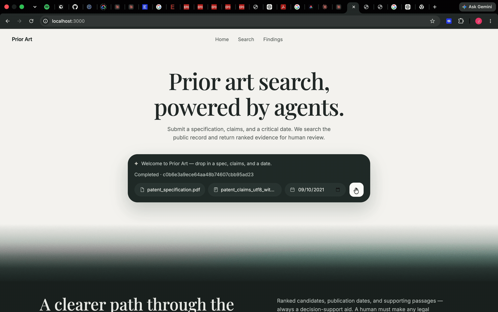
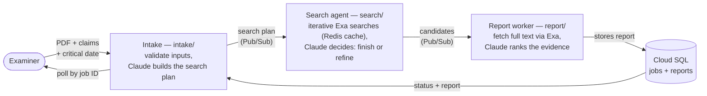
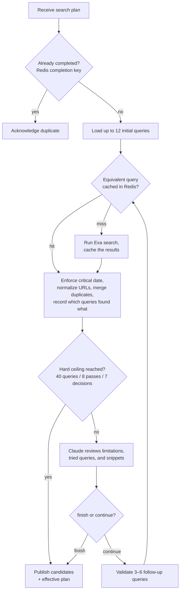

# Agentic Prior Art Search Assistant



A distributed application that helps a patent examiner find candidate prior art. The examiner submits a patent specification (PDF), a claims file (`.txt`), and a critical date; the system analyzes the claims with Claude, runs an iterative agent-guided web search over non-patent literature through Exa, ranks the evidence against specific claim limitations, and stores a citation-backed report the examiner retrieves by job ID.

It is **decision support only**: every report carries a disclaimer that a human must make any legal determination about patentability, anticipation, or validity. The system never draws legal conclusions.

Built as a three-process distributed system for a cloud-computing course assignment ([final_assignment.md](final_assignment.md)): three Python processes on separate GCP Compute Engine VMs, communicating only through cloud services — **Pub/Sub** (messaging), **Memorystore Redis** (caching), and **Cloud SQL PostgreSQL** (database). No containers, functions, or Kubernetes.

## Quick start

Requires Python 3.12+.

```bash
git clone <this repo> && cd agentic_patents
python3 -m venv .venv && source .venv/bin/activate
pip install -r requirements.txt
pytest -q        # 86 tests, all offline — no API keys or cloud services needed
```

The entire test suite runs against deterministic fakes (in-memory broker, in-memory job store, fake Redis, fake Claude, fake Exa), so it never makes a paid API call.

Each service can also run locally (`python -m intake.main`, `python -m search.main`, `python -m report.main`). By default (`APP_ENV=local`) each process wires its *own* in-memory broker and store, so local runs exercise one service at a time rather than the full pipeline — the services only talk to each other through real Pub/Sub when deployed. Setting `APP_ENV=gcp` (with the environment variables in [shared/config.py](shared/config.py)) switches a process to the production Cloud SQL, Pub/Sub, Redis, Exa, and Claude adapters.

To deploy the full system to GCP — provisioning, per-VM configuration, running a job end to end, and teardown — follow [deploy_instructions.md](deploy_instructions.md). The intake API binds to localhost on its VM and is reached through an SSH tunnel; a small browser UI in [Frontend/](Frontend/) proxies to that tunnel (`python Frontend/server.py`, then open `http://127.0.0.1:3000`).

## How it works



A job moves through five visible states stored in the database: `analyzing → searching → ranking → completed` (or `failed` with a short safe error code). End to end:

1. **Submit.** The examiner posts the three inputs to the intake service (`POST /jobs`), which validates file type, size (5 MB combined cap), UTF-8 claims encoding, and the `YYYY-MM-DD` date, and extracts embedded text from the PDF (no OCR — image-only PDFs are rejected). Invalid input gets a client-safe 400 that never echoes document text.
2. **Plan.** A structured LangChain Claude call breaks the claims into limitations, concepts, and synonyms and proposes up to 12 initial search queries, each linked to the limitations it targets. The validated plan is published to Pub/Sub and the caller gets a job ID immediately (202) — everything after this point is asynchronous.
3. **Search.** The search agent pulls the plan and runs a bounded agentic loop (detail below): execute queries through Exa (checking Redis first), filter by the critical date, deduplicate, then ask Claude whether coverage is sufficient or 3–6 targeted follow-up queries are worth running. When the loop ends, it publishes up to 25 candidates plus the *effective plan* — the original queries and every follow-up actually executed — so provenance survives.
4. **Rank.** The report worker pulls the batch, fetches full page content for every candidate through Exa (falling back to snippet-only with an uncertainty note if a URL keeps failing), and asks Claude to rank the evidence against specific claim limitations with supporting passages. Python re-validates everything: ranked URLs must come from the batch, citation URLs must match their candidate, and Claude cannot alter source metadata — it returns only rank, explanation, passages, and uncertainty notes; each result row is rebuilt from the original candidate.
5. **Retrieve.** The report worker stores the report and the `completed` status in one database transaction. The examiner polls `GET /jobs/{job_id}` on the intake service, which reads status and the finished report from the same database.

### The search agent's loop — the agentic part

Claude decides *when to stop and what to search next*; plain Python owns the loop and every hard ceiling. Claude can finish early but can never exceed 40 total queries, 8 search passes, or 7 continuation decisions, and it never executes Exa, Redis, or Pub/Sub operations itself.



### How the three required cloud technologies are used

| Technology | Service | Role in the successful path |
| --- | --- | --- |
| Messaging | GCP Pub/Sub | Two topics carry the work between processes: `search-plans` (intake → search) and `candidates` (search → report). Delivery is at-least-once, so every consumer is idempotent, and a message is only acknowledged after the component's own output has been published or stored. |
| Caching | Memorystore Redis | The search agent checks Redis before every Exa query (equivalent queries share an entry after normalization; the critical date is part of the key) and caches results for 24 h — resubmitting a job visibly turns misses into hits. Redis also holds per-job completion keys that suppress duplicate candidate batches. |
| Database | Cloud SQL PostgreSQL | The system of record for jobs and reports. The intake service creates and polls job rows; the report worker writes the report and `completed` status atomically, first-write-wins, so duplicate deliveries can never produce duplicate reports. |

## Approach

Three design rules shape most of the code:

- **The AI proposes; Python enforces.** Claude generates plans, decides continue-vs-finish, and ranks evidence — but every response is structured output validated against a Pydantic model, every loop and retry is bounded by constants in [shared/bounds.py](shared/bounds.py), and deterministic code makes the final call (date filtering, URL provenance, citation checks, report validation). A malformed or overreaching model response becomes a bounded retry or a safe `failed` state, never a corrupted report.
- **Narrow interfaces with deterministic fakes.** Claude, Exa, Pub/Sub, Redis, and the database each sit behind a small interface in [shared/](shared/) with an in-memory fake. Tests inject the fakes; production entry points wire the real adapters based on `APP_ENV`. That is why the whole suite runs offline and why each provider could be swapped without touching business logic.
- **Untrusted data stays data.** Uploaded patent text, Exa snippets, and retrieved web content are passed to Claude as tagged untrusted content, never as instructions. Document text is kept out of logs, Pub/Sub messages, and Redis keys; API keys and the database DSN are masked in config reprs; the search agent never receives database credentials at all.

## Project structure

| Path | What it is |
| --- | --- |
| [intake/](intake/) | **The intake FastAPI service** (the spec's Component A): upload validation and PDF text extraction ([extraction.py](intake/extraction.py)), the create-job → analyze → publish pipeline ([pipeline.py](intake/pipeline.py)), the `POST /jobs` / `GET /jobs/{id}` API ([api.py](intake/api.py)), and the production Claude claim-analysis adapter ([claude_adapter.py](intake/claude_adapter.py)). |
| [search/](search/) | **The search agent** (the spec's Component B): the Redis-aware query cache ([cache.py](search/cache.py)), date filtering and dedup ([consolidate.py](search/consolidate.py)), concurrent Exa execution ([executor.py](search/executor.py)), the bounded iterative loop ([loop.py](search/loop.py)), the Claude search-decision adapter ([claude_adapter.py](search/claude_adapter.py)), and the Pub/Sub worker ([worker.py](search/worker.py)). |
| [report/](report/) | **The report worker** (the spec's Component C): content retrieval and ranking pipeline ([pipeline.py](report/pipeline.py)), the Claude ranking adapter ([claude_adapter.py](report/claude_adapter.py)), and the worker that handles terminal failures, duplicates, and storage ([worker.py](report/worker.py)). |
| [shared/](shared/) | Code all three processes import: message/report contracts ([models.py](shared/models.py)), every numeric limit ([bounds.py](shared/bounds.py)), env config ([config.py](shared/config.py)), redacting logger ([logging.py](shared/logging.py)), broker interfaces + in-memory broker ([messaging.py](shared/messaging.py)), job-store interface + schema ([db.py](shared/db.py)), and the production GCP adapters ([pubsub.py](shared/pubsub.py), [cloudsql.py](shared/cloudsql.py)). |
| [shared/providers/](shared/providers/) | Narrow Claude and Exa interfaces with deterministic fakes ([claude.py](shared/providers/claude.py), [exa.py](shared/providers/exa.py)). Only adapter modules know the real SDKs exist. |
| [Frontend/](Frontend/) | Minimal browser UI: a static page ([index.html](Frontend/index.html), [app.js](Frontend/app.js)) served by a tiny proxy ([server.py](Frontend/server.py)) that forwards `/jobs` to the SSH-tunneled intake API and polls until the report renders. |
| [deploy/](deploy/) | Bash scripts for GCP: [provision.sh](deploy/provision.sh) (topics, subscriptions, Cloud SQL, Redis, service accounts, three VMs), [update.sh](deploy/update.sh) (deploy committed `HEAD` and restart systemd services), [teardown.sh](deploy/teardown.sh). |
| [tests/](tests/) | 86 offline tests covering the contracts, each component's happy path, and the failure modes (invalid uploads, provider failures, hard ceilings, invented URLs, duplicate deliveries, cache expiry). |
| [spec.md](spec.md) | The detailed design document: per-component requirements, sequence diagrams, and a candid list of assumptions and known limits per section. |
| [proposal.md](proposal.md), [final_assignment.md](final_assignment.md) | The original project proposal and the assignment brief/rubric. |

## Tools used

| Tool | Why |
| --- | --- |
| Python 3.12 + FastAPI + uvicorn | The intake API; the search and report processes are plain background workers. |
| Pydantic v2 | Every message, model response, and report is a validated contract; extra fields, broken provenance links, and duplicate ranks are rejected at the boundary. |
| LangChain (`langchain-anthropic`) + Claude Sonnet 5 | Structured-output calls for the three AI roles: claim analysis, search decisions, evidence ranking. Temperature 0 where the model allows it, bounded retries, finite timeouts. |
| Exa (`exa-py`) | Web search over non-patent literature (search agent) and full-page content retrieval (report worker), with published-date metadata. |
| GCP Pub/Sub, Memorystore Redis, Cloud SQL PostgreSQL (`psycopg`) | The three required distributed-system components — see the table above. |
| pypdf | Embedded-text extraction from the specification PDF. |
| pytest | The offline test suite. |
| Vanilla JS/HTML/CSS | The frontend has no build step or dependencies. |

## Assumptions

- Specification PDFs contain embedded text; scanned/image-only PDFs are rejected rather than OCRed. Claims are plain UTF-8 text. The 5 MB upload cap covers both files combined.
- The critical date is supplied by the examiner and taken as given (any valid calendar date). Same-day publications count as on-or-before the critical date; results dated *after* it are dropped; **undated results are kept** and flagged `unknown` so the report worker and the human can weigh them, rather than silently discarding possible art.
- The numeric ceilings (12 initial / 40 total queries, 8 passes, 7 decisions, 25 candidates, 24 h cache TTL, 3 retries) are class-demo budgets chosen for cost and demonstrability, not measured production limits. They all live in [shared/bounds.py](shared/bounds.py).
- Claude's confidence and relevance judgments are advisory. Supporting passages are requested from the source text and their URLs are verified against the candidate, but passages are not yet verbatim-checked against the page.
- Message contracts have no schema-version field; all three services are always deployed from the same commit.
- Uploaded documents are processed in memory and not stored; only structured intermediate results travel through Pub/Sub, never raw document text.
- The intake API is not publicly exposed; access for the demo is through an encrypted SSH tunnel, which is why the frontend runs locally and proxies.

## Known limitations

- **Local mode is per-service.** Each local entry point creates an isolated in-memory broker and store, so the full intake → search → report pipeline only runs against real Pub/Sub in the GCP deployment.
- A Pub/Sub payload that can never decode is logged and dropped to avoid infinite redelivery, which strands its job in the last visible status; a stuck-job timeout sweep or dead-letter topic is noted follow-up work in [spec.md](spec.md) §11.
- Content retrieval in the report worker is sequential with no retry backoff (worst case 75 Exa content requests for a 25-candidate batch), and 25 full bodies can make a large ranking prompt; real-world token cost and ranking quality haven't been benchmarked.
- Exa/Claude retries share simple fixed budgets (3 attempts, no backoff), and some distinct failure causes share one safe error code (e.g. `analysis_failed`, `decision_failed`).
- Deployment conveniences for the class demo: the default `postgres` database user, Redis without AUTH/TLS (private VPC only), and VMs with external IPs for outbound API traffic. See the end of [deploy_instructions.md](deploy_instructions.md).
- Out of scope by design: OCR, patent-database search (non-patent literature only), user accounts, and any autonomous legal conclusion.
