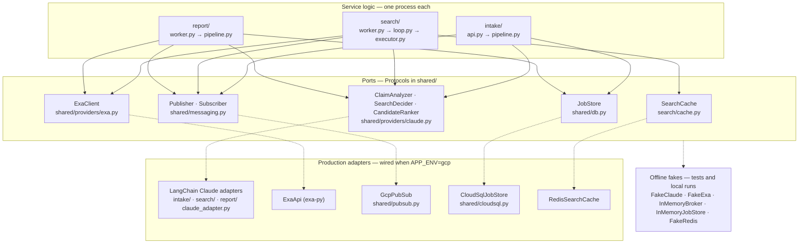
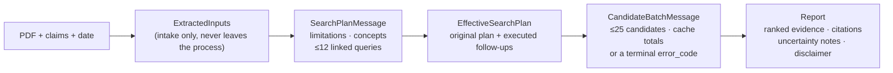
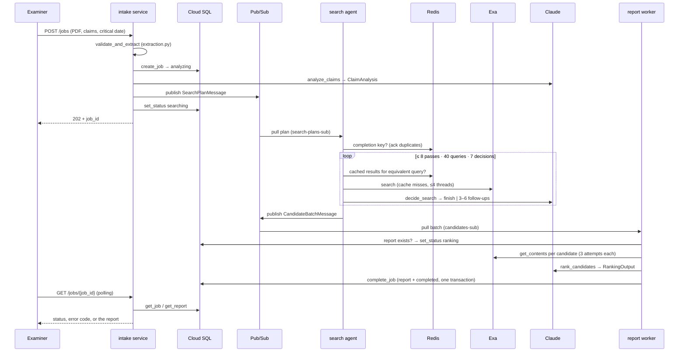

# Architecture

This document covers the code-level design: how the three processes are structured, the contracts they communicate through, where validation happens, and how the paid providers (Claude, Exa) and cloud services are kept behind swappable interfaces. For what the system does, how to run it, and the business-logic flow, start with the [README](README.md). The design history — including per-section assumptions and known limits — lives in [spec.md](spec.md), which names the three services Components A, B, and C.

The system is a pipeline of three Python processes — the **intake service** ([intake/](intake/)), the **search agent** ([search/](search/)), and the **report worker** ([report/](report/)) — that never import each other and share no memory. They share exactly two things: the [shared/](shared/) library (data contracts and interfaces) and the cloud services between them (Pub/Sub, Redis, Cloud SQL). That constraint is what makes the system distributable: each process can run on its own VM, restart independently, and receive duplicate messages without corrupting a job.

## Ports and adapters

Every external dependency sits behind a small Python `Protocol` ("port") defined in `shared/`. Service logic depends only on the ports; concrete adapters are chosen at startup. That is why the whole test suite runs offline and why any provider could be replaced without touching business logic.

| Piece | Responsibility | Files |
| --- | --- | --- |
| Contracts | Every message and report type, with strict validation; every numeric ceiling | [shared/models.py](shared/models.py), [shared/bounds.py](shared/bounds.py) |
| Ports | The interfaces above — no SDK types leak through them | [shared/providers/](shared/providers/), [shared/messaging.py](shared/messaging.py), [shared/db.py](shared/db.py), [search/cache.py](search/cache.py) |
| Claude adapters | One per AI role: prompt, `langchain-anthropic` structured-output call, bounded retries, finite timeout | [intake/claude_adapter.py](intake/claude_adapter.py), [search/claude_adapter.py](search/claude_adapter.py), [report/claude_adapter.py](report/claude_adapter.py) |
| Cloud adapters | Real Pub/Sub (blocking confirmed publish, explicit ack/nack), Cloud SQL (schema on startup, atomic completion), Redis, Exa | [shared/pubsub.py](shared/pubsub.py), [shared/cloudsql.py](shared/cloudsql.py), [search/cache.py](search/cache.py), [shared/providers/exa.py](shared/providers/exa.py) |
| Fakes | Deterministic stand-ins for all five ports; `FakeClaude` implements all three AI roles | same modules as their ports |
| Cross-cutting | Env settings (secrets masked in reprs; the search agent's loader has no database DSN), redacting structured logger | [shared/config.py](shared/config.py), [shared/logging.py](shared/logging.py) |

Each service's `main.py` is its only composition point: it reads `APP_ENV` and wires either the production adapters (`gcp`) or the in-memory fakes (`local`, the default). Tests skip `main.py` entirely and inject fakes directly — through FastAPI dependency overrides for the intake API, plain function arguments everywhere else.

## The contracts, from upload to report

One job's data passes through four validated shapes. All of them are pydantic models built on a shared `StrictModel` base that rejects unknown fields, and the interesting rules are cross-field validators — the contract layer catches entire classes of bugs (and of model misbehavior) before any business logic runs.

- **`SearchPlanMessage`** (intake → search): the job ID, critical date, claim limitations, concepts/synonyms, and at most 12 initial queries. Every query must link to limitation IDs that exist on the message, and all IDs must be unique — a plan with a dangling link is unbuildable.
- **`CandidateBatchMessage`** (search → report): the **effective plan** (the original plan plus every follow-up query actually executed — the job ID travels inside it) and up to 25 `Candidate` rows: title, URL, snippet, publication date with a `date_check` state (`verified` / `unknown`), and the IDs of the queries that found it, which must exist in the effective plan. Alternatively it carries a sanitized terminal `error_code` (lowercase token only, so provider text can never leak through) — and then it must carry *no* candidates.
- **`Report`** (stored in Cloud SQL, returned to the examiner): `RankedEvidence` entries embedding the full original `Candidate` plus rank, explanation, and URL-checked `Citation` passages; uncertainty notes; and a disclaimer field that validation pins to the exact human-review wording — a report that drops or edits it cannot exist.

Messages cross Pub/Sub through `encode`/`decode` in [shared/messaging.py](shared/messaging.py), which serialize models as UTF-8 JSON bounded at 256 KB. Publishers can only send validated models, and consumers re-validate on decode, so both ends of every hop enforce the same contract. Messages carry structured intermediate results only — never uploaded document text.

## The life of a job

Inside each process:

- **Intake** ([api.py](intake/api.py) → [pipeline.py](intake/pipeline.py)): the API layer owns HTTP concerns (202/400/404/502 and client-safe error bodies); `run_intake` owns the sequence create-job → analyze → publish. Claude's `ClaimAnalysis` is deliberately rebuilt into a `SearchPlanMessage` so the shared validators run on what is actually published. Any failure marks the job `failed` with a short code (`analysis_failed` / `publish_failed`) — no job runs forever.
- **Search agent** ([worker.py](search/worker.py) → [loop.py](search/loop.py)): the worker handles one plan at a time and duplicate suppression; `run_search_loop` owns the iterative state and enforces every ceiling in plain Python — Claude chooses *finish or continue* through the validated `SearchDecision` type but executes nothing itself. Each pass runs through [executor.py](search/executor.py) (Redis check first, then Exa for misses only) and [consolidate.py](search/consolidate.py) (drop post-critical-date results, keep undated ones as `unknown`, normalize URLs, merge duplicates, union query provenance).
- **Report worker** ([worker.py](report/worker.py) → [pipeline.py](report/pipeline.py)): the worker routes terminal search failures to `failed` and duplicates to an ack; `run_ranking` fetches content per candidate (a repeatedly failing URL degrades that candidate to snippet-only plus an uncertainty note rather than failing the job), calls the ranker, then rebuilds each result from the original `Candidate` row — Claude returns only rank, URL, explanation, passages, and notes, so it cannot alter titles, dates, or provenance.

## Where validation happens

Four gates, each a different job. By the time a report is stored, its every ingredient has been checked at least twice.

| Gate | Where | Rejects |
| --- | --- | --- |
| 1. Upload guard | [intake/extraction.py](intake/extraction.py), before any job or AI call | Non-PDF bytes, image-only PDFs (no OCR), non-UTF-8 claims, malformed dates, >5 MB combined uploads. Errors are client-safe and never echo document text. |
| 2. Message contracts | [shared/models.py](shared/models.py), enforced on both publish and decode | Unknown fields, duplicate or dangling IDs, over-limit lists, oversized payloads, unsafe error codes, candidates attached to a terminal failure. |
| 3. Claude structured output | Each `claude_adapter.py` (`ClaimAnalysis` / `SearchDecision` / `RankingOutput`), plus loop-level checks | Malformed or out-of-contract replies; follow-up sets outside 3–6 or over the total budget. Bad output is retried (≤3 attempts), then becomes a safe failure code — never a corrupted message. |
| 4. Report cross-checks | [report/pipeline.py](report/pipeline.py) + the `Report` model | Ranked URLs not in the candidate batch (invented sources), citation URLs that don't match their candidate, job ID/date mismatches, duplicate ranks, a missing or altered disclaimer. |

## Reliability: at-least-once, so everything is idempotent

Pub/Sub may deliver any message more than once, and any process may crash mid-job. The design rules that absorb this:

- **Ack only after output exists.** A consumer acknowledges its input only after its own output is published or stored (`GcpPubSub.publish` blocks until GCP confirms). A crash before that point means redelivery and a retry, not a lost job.
- **Duplicates are cheap no-ops.** The search agent records a per-job Redis completion key and skips plans it has already answered; the report worker checks for an existing report before ranking, `save_report` is first-write-wins (`ON CONFLICT DO NOTHING`), and `complete_job` writes the report and the `completed` status in one Cloud SQL transaction — duplicate deliveries can never produce duplicate or half-written reports.
- **Everything is bounded.** Every ceiling lives in [shared/bounds.py](shared/bounds.py): uploads, message bytes, query counts (12 initial / 40 total), passes (8), decisions (7), candidates (25), snippet/passage lengths, concurrency (4), retries (3 attempts), cache TTL (24 h). Claude can end work early but can never extend it.
- **Failures land in a visible state.** Non-retryable failures mark the job `failed` with one of a small set of lowercase codes (`analysis_failed`, `publish_failed`, `search_failed`, `decision_failed`, `ranking_failed`); the examiner sees the state by polling. The known gap: a Pub/Sub payload that can never decode is logged and dropped, stranding its job in the last visible status ([spec.md](spec.md) §11 discusses the planned timeout sweep).

## Security boundaries

- **Untrusted data stays data.** Uploaded specification/claims text, Exa snippets, and retrieved web content are sent to Claude as tagged untrusted content; instructions live only in system prompts. Nothing from a document or web page is ever executed, and result URLs are only fetched through Exa's contents API, never directly.
- **Least knowledge per process.** The search agent's settings loader (`load_search_settings`) cannot even read the Cloud SQL DSN — the process that touches the open web has no database credentials. The intake API binds to localhost on its VM and is reached through an SSH tunnel ([deploy_instructions.md](deploy_instructions.md)); Cloud SQL and Redis are private-network only.
- **Nothing sensitive in the exhaust.** [shared/logging.py](shared/logging.py) emits bounded lifecycle fields (component, job ID, event, duration, error code) and redacts multiline, oversized, or credential-like values; config reprs mask API keys and the DSN; Redis keys contain normalized query text but never document text; error codes are validated tokens so provider or document text cannot ride along.

## Testing strategy

The 86 tests in [tests/](tests/) run entirely offline against the fakes, which are real implementations of the same ports (`FakeRedis` honors TTLs; `InMemoryBroker` is a genuine FIFO with ack/nack; `InMemoryJobStore` is idempotent like Cloud SQL). Because contracts are enforced in the models rather than in any service, the tests exercise the same validation production runs: happy paths, every upload rejection, provider failures and malformed AI output, each hard ceiling, invented/mismatched URLs, terminal failures, empty-result reports, cache miss-to-hit behavior, and duplicate delivery for both workers. The production adapters (`GcpPubSub`, `CloudSqlJobStore`, `RedisSearchCache`, `ExaApi`, the LangChain adapters) are deliberately thin — mostly translation and error mapping — so the untested surface is small.
