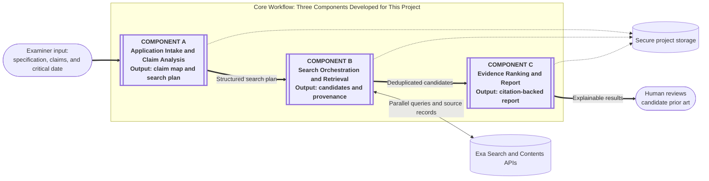

# Agentic Prior Art Search Assistant

Name: Jack Ransom

Date: 8/7/2026

## Title & Brief Description of Use Case

When a patent examiner receives a patent application, the examiner must understand the specification, break each claim into limitations, select useful search concepts, and search for earlier publications that disclose those concepts. The Agentic Prior Art Search Assistant will accept a patent specification, claims, and a user-supplied critical date; create a structured search plan; run prior art searches in parallel; and return a ranked, citation-backed report of candidate prior art.

The system is a decision-support tool. It will help a human examiner decide what to review, but it will not make a legal conclusion that a claim is patentable or unpatentable.

## Problem Statement & Business Value

Prior art searching is a time-intensive part of patent examination. An examiner must learn the invention, identify the claim language that matters, try multiple combinations of keywords and classifications, review many weak results, and preserve enough search history to explain the work. Examiners may spend much of the time allotted to an application on searching and preparing a rejection, which increases cost and limits examination throughput. New examiners are expected to search for prior art and type up a rejection within 30 hours. It is not until an examiner is promoted to GS-12, which may take several years, that the patent office breaks even on the examiner's pay compared to fees collected from the patent application.

The system's primary business value is reducing the time between receiving an application and finding useful candidate references. It can also:

- run several search strategies concurrently;
- apply the same claim-analysis process consistently;
- connect each result to the claim limitations and passages that made it relevant; and
- preserve an auditable record of queries, filters, and source metadata.

## Overview of the Three Components

### Component A: Application Intake and Claim Analysis Service

This component accepts the specification (description of invention), claims (the scope of what the inventor is claiming they invented), and critical date (effectively filed date for invention). It then produces a structured search plan containing key concepts, synonyms and query combinations. 

### Component B: Search Orchestration and Retrieval Service

This component converts the search plan into queries and executes them in parallel through the Exa Search API. It will search primarly non-patent literature sources, applies Exa's published-date filter for initial screening, deduplicates results, and records query provenance.

### Component C: Evidence Ranking and Report Service

This component performs a staged relevance review and retrieves additional source content only for candidates that appear relevant or remain uncertain. It ranks those candidates and generates a report containing the searches that found each result. 

## Interaction Workflow Description

1. The examiner submits one application and chooses the claims to search.
2. Component A creates a claim map and search plan.
3. Component B runs multiple queries concurrently, filters out publications that fail the date rules, and consolidates duplicate results.
4. Component C screens the candidates, reviews promising or uncertain results in greater detail, and creates an explainable report with supporting passages.
5. The examiner follows the source links, reviews the documents, and decides whether the results should affect examination.

## Initial Thoughts on Implementation Stack

Below are my preliminary thoughts on my tech stack.

### Component A: Application Intake and Claim Analysis

Component A will be a Python and FastAPI application. A LangChain agent will call Claude to analyze the specification and claims and generate validated claim limitations, synonyms, and search terms.

### Component B: Search Orchestration and Retrieval

Component B will use the same Python, FastAPI, LangChain, and App Engine (GCP) stack to execute the generated terms through the Exa Search API. It will handle concurrent searches, retries, deduplication, source validation, and query provenance.

### Component C: Evidence Ranking and Report

Component C will use the same Python, FastAPI, LangChain, and App Engine (GCP) stack to perform staged review, rank verified results, and generate the final report. Reports will be stored in Cloud Storage, while structured results and citation records will be stored in Cloud SQL.