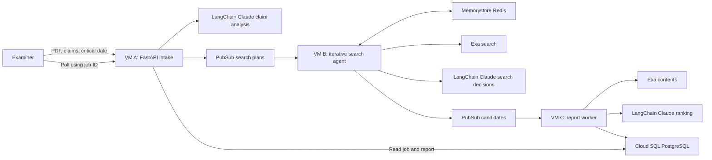
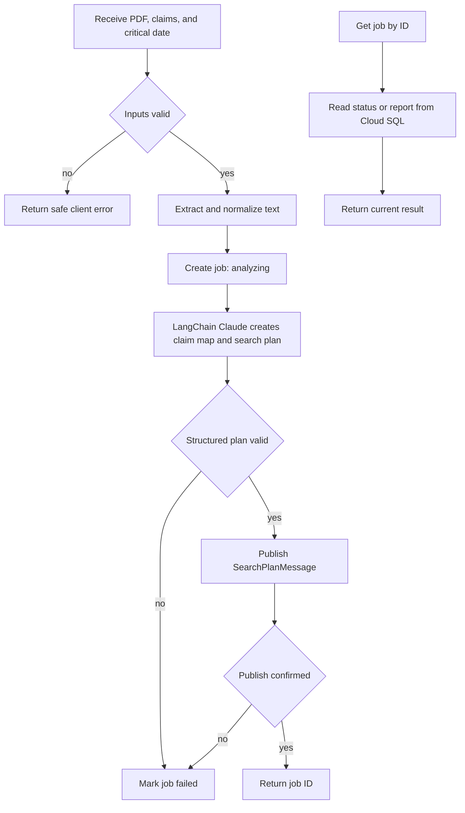
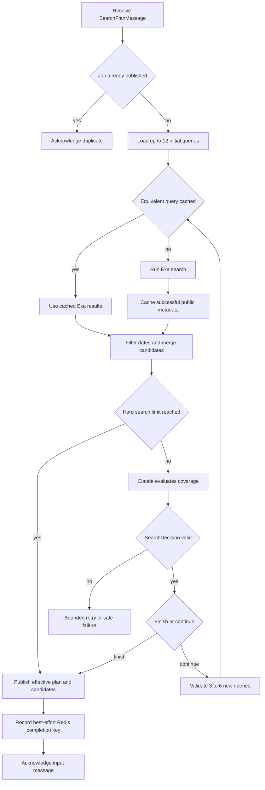
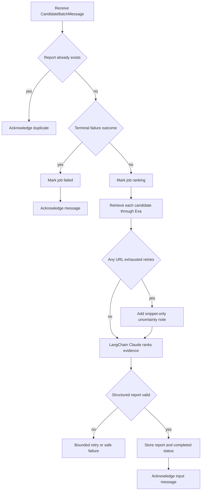

# Agentic Prior Art Search Assistant — High-Level Plan

Status: shared foundation and Components A–C implemented locally; production cloud wiring pending
Language: Python  
Cloud: Google Cloud Platform (GCP)

## 1. Project Goal

Build a distributed application that helps a patent examiner find candidate
prior art. The user submits a patent specification, claims, and a critical
date. The system creates a search plan, searches non-patent literature, ranks
the results, and returns a citation-backed report for human review.

The application is a decision-support tool. It must not make legal conclusions
about patentability, anticipation, obviousness, or validity.

This document intentionally stays at the architectural level. Before
implementing a component, use `.cursor/rules/task-breakdown.mdc` to divide that
component into small implementation tasks.

## 2. Assignment Requirements

The deployed project will have three distinct Python processes:

1. Component A: application intake and claim analysis.
2. Component B: search orchestration and retrieval.
3. Component C: evidence ranking and report storage.

Each process will run on a separate GCP Compute Engine VM.

The project will use three of the assignment's required technology categories:

- Messaging: GCP Pub/Sub.
- Caching: GCP Memorystore for Redis.
- Database: GCP Cloud SQL for PostgreSQL.

The deployment will not use functions, containers, Kubernetes, or a service
mesh. Pub/Sub is treated only as messaging, so the project does not depend on
counting it as both messaging and queuing.

Claude and Exa are application APIs from the original proposal. Their use
should be confirmed with the instructor before cloud deployment because the
assignment restricts the permitted cloud components.

## 3. Inputs and Output

Component A will accept:

- a specification PDF containing embedded text;
- a UTF-8 plain-text `.txt` claims file; and
- a critical date in `YYYY-MM-DD` format.

Scanned or image-only PDFs are outside the initial scope. The project will not
include OCR.

The final output will be a structured report containing:

- ranked candidate references;
- source titles, URLs, and publication dates;
- the searches that found each candidate;
- claim limitations associated with each candidate;
- supporting passages when available;
- relevance explanations and uncertainty notes; and
- a clear statement that a human must make any legal determination.

## 4. Architecture

The three application components communicate asynchronously. Component A
returns a job ID after publishing the search plan. The user then polls
Component A until Component C has stored the final report.

Sections 5 through 11 are ordered by implementation: each foundation-update
section must be completed immediately before the component that depends on it.

## 5. Shared Foundation (IMPLEMENTED)

The three components share the `shared/` Python package for:

- validated message and report models;
- configuration loading;
- consistent safe logging;
- Pub/Sub serialization and validation;
- database access used by Components A and C; and
- narrow Claude and Exa interfaces that can be replaced with fakes in tests.

This shared foundation was built first. It prevents the independently
running components from disagreeing about message formats, job states, or
report structure and avoids duplicated code.

### 5.1 Implemented Foundation

The following foundation work is complete:

- `shared/bounds.py` defines job states and limits for claims, queries, search
  passes, continuation decisions, candidates, content retrieval, uploads,
  retries, concurrency, messages, and Redis cache lifetime.
- `shared/models.py` defines validated search-plan, candidate-batch, and report
  contracts, including Component B's effective search plan and terminal-failure
  outcome. It rejects extra fields, duplicate IDs, broken limitation links,
  candidate provenance missing from the effective plan, duplicate candidate
  URLs, invalid date states, unsafe error codes, duplicate report ranks, and
  replacement of the required human-review disclaimer.
- `shared/config.py` loads required settings from environment variables or an
  optional `.env` file, fails on missing values, and masks API keys and the
  database DSN in its representation. Component B has a separate settings
  loader that does not read or expose the Cloud SQL DSN.
- `shared/logging.py` emits bounded lifecycle fields and redacts multiline,
  oversized, credential-like, and configured secret values.
- `shared/messaging.py` serializes pydantic models as bounded UTF-8 JSON and
  provides Publisher and Subscriber interfaces plus an in-memory FIFO broker.
- `shared/db.py` defines the PostgreSQL jobs/reports schema, the JobStore
  interface, and an idempotent in-memory implementation for local use.
- `shared/providers/claude.py` defines narrow interfaces for each Claude
  consumer: `ClaimAnalyzer` for Component A, `SearchDecider` for Component B,
  and `CandidateRanker` for Component C. Its deterministic fake supports all
  three without calling paid APIs.
- `shared/providers/exa.py` defines the narrow Exa interface, deterministic
  fake, and production `exa-py` client. The production client bounds search
  results and content fetches, maps provider responses into shared types, and
  truncates snippets and retrieved text.
- The project uses Python 3.12+, a local `.venv`, and dependencies listed in
  `requirements.txt`.

The current message contracts intentionally have no schema-version field. If a
contract changes, all three components will be updated together.

## 6. Foundation Updates Required Before Component A (COMPLETED)

These shared updates are in place so Component A's output contract and tests
can depend on them:

- `shared/bounds.py` defines Component A's limit of at most 12 initial
  queries (`MAX_INITIAL_QUERIES`) separately from Component B's larger total
  search budget, and `SearchPlanMessage` enforces that 12-query limit.
- Automated tests cover the implemented foundation: models, configuration,
  logging, messaging, storage, and provider fakes. Later components then
  build on verified contracts.

## 7. Component A — Intake and Claim Analysis (IMPLEMENTED)

Component A's code lives in the `intake/` package. It is a FastAPI service
responsible for:

- receiving the specification PDF, claims file, and critical date;
- validating file type, size, encoding, extracted text, and date;
- extracting embedded text from the specification;
- creating a job record in Cloud SQL;
- using a structured LangChain Claude call to identify claim limitations,
  concepts, synonyms, and at most 12 useful initial queries;
- validating Claude's structured response;
- publishing the search plan to Pub/Sub; and
- returning job status or the final stored report through the API.

Uploaded documents are processed without long-term storage in the initial
version. Raw document text must not be placed in logs or Pub/Sub messages.

Component A also includes the production LangChain (`langchain-anthropic`)
claim-analysis adapter behind the shared `ClaimAnalyzer` interface; automated
tests keep using the deterministic fake.

### 7.1 Implemented Component A

- `intake/extraction.py` validates uploads and returns normalized text: it
  enforces the combined `MAX_UPLOAD_BYTES` cap, rejects non-PDF bytes and
  image-only PDFs (no OCR), requires UTF-8 claims, and parses a strict
  `YYYY-MM-DD` critical date. Validation errors carry client-safe messages
  that never echo document text.
- `intake/pipeline.py` implements the sequence below: create the job in
  `analyzing`, call `ClaimAnalyzer.analyze_claims`, rebuild the result as a
  `SearchPlanMessage` so the shared validators run, publish it, and set the
  job to `searching`. Failures mark the job `failed` with a short safe code
  (`analysis_failed` or `publish_failed`) so no job runs indefinitely.
- `intake/api.py` exposes `POST /jobs` (202 with job ID; 400 for invalid
  input; 502 with job ID and error code when analysis or publish fails) and
  `GET /jobs/{job_id}` (status, error code if failed, and the stored report
  once completed; 404 for unknown IDs). Backends are injected through FastAPI
  dependencies; `intake/main.py` wires local runs.
- `intake/claude_adapter.py` implements `ClaimAnalyzer` with
  `langchain-anthropic` structured output validated against `ClaimAnalysis`,
  temperature 0, and `MAX_RETRIES` bounded provider retries. Instructions
  live in the system prompt; uploaded documents are passed only as tagged
  untrusted data.
- Tests in `tests/test_intake_extraction.py` and `tests/test_intake_api.py`
  cover the happy path, every rejection case, provider and publish failures,
  and polling. They use the in-memory fakes and never call paid APIs.

Assumptions and known limits of this version:

- `MAX_UPLOAD_BYTES` is a combined cap for both files, and uploads are read
  fully into memory before the size check; a streaming guard is production
  follow-up work.
- The critical date has no plausibility range check; any valid calendar date
  is accepted.
- One `analysis_failed` code covers both provider errors and invalid
  structured output, and the pipeline itself does not retry (only the
  adapter's provider-level retries are bounded by `MAX_RETRIES`).
- The adapter's default model name must be re-verified before deployment,
  and very long specifications are sent whole because `shared/bounds.py`
  defines no extracted-text length cap yet.
- Local runs (`python -m intake.main`) use the in-memory store and broker
  and `FakeClaude`; jobs vanish on restart. Real Cloud SQL, Pub/Sub, and
  Claude wiring arrive with Section 11.

### Component A Sequence

## 8. Foundation Updates Required Before Component B (COMPLETED)

The existing foundation has been extended for the new Component B design:

- `shared/bounds.py` allows at most 40 total queries, eight search passes,
  seven Claude continuation decisions, and three to six follow-up queries per
  decision. It also defines a finite 24-hour Redis cache TTL.
- `shared/models.py` makes `CandidateBatchMessage` carry the effective
  search plan, meaning the original plan plus every follow-up query actually
  executed by Component B. The job ID travels inside that plan, so Component C
  reads it from there.
- `CandidateBatchMessage` also carries a sanitized terminal-failure error code
  so Component C can mark a job failed when Component B's search permanently
  fails.
- Candidate query IDs must exist in that effective plan. Candidates no longer
  duplicate limitation IDs: a query's intended
  limitations must be derived from its `SearchQuery.limitation_ids` mapping
  rather than treated as independent proof that a document contains those
  limitations. Component C will make the actual evidence determination.
- `shared/providers/claude.py` adds the separate `SearchDecider` interface,
  validated `SearchDecision` response, and deterministic fake for Component B.
  Its production `langchain-anthropic` implementation now lives in
  `search/claude_adapter.py`.
- `shared/providers/exa.py` includes a production `ExaApi` implementation
  using `exa-py`; tests continue to use the deterministic fake.
- `shared/config.py` provides `SearchSettings` and `load_search_settings()`,
  which load only the Pub/Sub, Redis, Exa, Anthropic, and logging settings
  Component B needs and do not load the Cloud SQL DSN.

The `SearchDecision` data contract lives beside the narrow shared Claude
interface for Component B (alongside `ClaimAnalyzer` and `CandidateRanker`)
so the fake and production adapter return the same validated type. The
iterative loop and its state belong inside Component B.

Automated tests cover effective-plan validation, query provenance, terminal
failures, the 40-query totals bound, fake finish/continue decisions, and
Component B settings without Cloud SQL credentials. The full suite currently
passes without paid API calls.

## 9. Component B — Search Orchestration and Retrieval (IMPLEMENTED LOCALLY)

Component B's code lives in the `search/` package. It is a bounded iterative
search agent running as one background worker. It:

- receives a structured search plan from Pub/Sub, not the raw specification or
  claims files;
- executes up to 12 initial Exa queries using bounded concurrency;
- checks Redis before each equivalent Exa query and caches successful public
  result metadata for a limited time;
- re-validates publication dates after retrieval;
- enforces the critical date, normalizes URLs, merges duplicates, and preserves
  which executed queries found each candidate;
- gives Claude the claim limitations, tried queries, and bounded candidate
  snippets after each search pass;
- uses a small validated `SearchDecision` response in which Claude chooses
  `finish` or `continue`, identifies remaining coverage gaps, and supplies
  three to six follow-up queries when continuing;
- repeats until Claude finishes or Python enforces a hard ceiling of 40 total
  queries, eight search passes, or seven continuation decisions;
- carries the original and follow-up queries forward as the effective search
  plan; and
- publishes the candidates, effective plan, provenance, and cache totals to
  Component C through Pub/Sub.

Claude chooses when sufficient searching has been performed, but ordinary
Python controls the loop and all hard limits. The MVP will not use an
open-ended ReAct agent, LangGraph, multiple agents, or a feedback topic from
Component C.

Redis is part of the successful application path, not an unused supporting
service. Repeating the same searches should visibly produce cache hits.

Component B does not retrieve full documents, rank evidence, draw legal
conclusions, or access Cloud SQL. Those responsibilities remain with Component
C.

### 9.1 Implemented Component B

- `search/cache.py` defines the `SearchCache` interface, a TTL-aware
  `FakeRedis`, and the production `RedisSearchCache`. Equivalent queries share
  cache entries after lowercasing and collapsing whitespace; the critical date
  remains part of the key. Successful empty Exa results are cached too.
- `search/consolidate.py` re-checks dates, drops results after the critical
  date, keeps undated results as `unknown`, normalizes URLs, removes common
  tracking parameters, merges duplicates, and unions query provenance.
- `search/executor.py` checks the cache sequentially and runs only cache misses
  through Exa with at most four worker threads. Each Exa query receives at most
  three total attempts, and successful results are cached before the pass
  reports any terminal error.
- `search/loop.py` owns the iterative state and enforces the 40-query,
  eight-pass, and seven-decision ceilings. It validates Claude follow-ups
  against the effective plan, publishes `search_failed` or `decision_failed`
  terminal outcomes without partial candidates, and otherwise returns the
  final candidates and effective plan.
- `search/claude_adapter.py` implements the production `SearchDecider` with
  `langchain-anthropic` structured output. It sends limitations, tried queries,
  and bounded candidate snippets as tagged untrusted data.
- `search/worker.py` handles one plan at a time, skips jobs with an existing
  Redis completion key, publishes one final candidate batch per handling, and
  then records completion best-effort. `search/main.py` wires the in-memory
  broker and provider fakes for local runs.
- Component B tests cover cache normalization and expiry, miss-to-hit behavior,
  date filtering, URL deduplication, provenance, immediate finish,
  continuation, every hard ceiling, invalid follow-ups, provider failure, and
  duplicate worker delivery. The full suite currently has 78 passing tests
  without paid API calls.

Assumptions and known limits of this version:

- Same-day publications are treated as on/before the critical date. Results
  after the critical date are dropped; undated results remain candidates for
  Component C to assess.
- Query-cache and completion keys both expire after 24 hours. Normalized query
  text appears in Redis keys; uploaded specification and claims text do not.
- URL normalization removes `utm_*` and a short list of common click-tracking
  parameters. Other tracking parameters may prevent two equivalent URLs from
  merging, and conflicting dates keep the first dated value seen.
- Exa retries have no backoff, and `MAX_RETRIES` means three total attempts.
  Claude provider errors and invalid decisions currently share one retry
  budget and one terminal `decision_failed` outcome.
- `RedisSearchCache` assumes the default Redis port with no AUTH or TLS and has
  no explicit socket timeout. These settings must be verified against the
  Memorystore configuration before deployment.
- A Redis failure during the duplicate check prevents processing until the
  message is retried. A failure while writing the completion key occurs after
  publication and can therefore permit a later duplicate batch; Component C
  must remain idempotent.
- Local `search/main.py` creates its own empty `InMemoryBroker`, so it does not
  communicate with `intake/main.py`. Real Pub/Sub, acknowledgement handling,
  poison-message handling, and production dependency wiring remain Section 11
  work.

### Component B Sequence

Exa results feed the Claude decision, and Claude's follow-up queries feed the
next Exa pass through Component B. They are sequential parts of one bounded
loop, not parallel workflows.

## 10. Component C — Evidence Ranking and Report Storage (IMPLEMENTED LOCALLY)

Component C's code lives in the `report/` package. It is a background
worker responsible for:

- receiving candidate batches from Pub/Sub;
- retrieving full Exa content for every candidate in the batch (the batch is
  already capped at 25 candidates, so content fetches share that bound);
- using a structured LangChain Claude call to evaluate candidates against
  specific claim limitations;
- requesting source-linked supporting passages for positive findings and
  rejecting citations whose URL does not match the ranked candidate;
- preserving uncertainty when dates or evidence are incomplete;
- generating the structured decision-support report; and
- storing the report and final job status in Cloud SQL.

Component C must handle duplicate Pub/Sub deliveries without creating duplicate
reports or repeating expensive ranking work unnecessarily.

Building Component C also includes the production LangChain Claude ranking
adapter behind the shared `CandidateRanker` interface, implemented inside
`report/`; automated tests keep using the deterministic fake.

### 10.1 Implemented Component C

- `shared/bounds.py` sets `MAX_CONTENT_FETCHES` equal to the existing
  `MAX_CANDIDATES` cap of 25. Component C therefore attempts to retrieve full
  content for every candidate rather than screening candidates first.
- `report/pipeline.py` retrieves each candidate URL independently through Exa.
  Each URL receives at most three total attempts, so one failed URL does not
  prevent the remaining candidates from being fetched. Exhausted URLs fall
  back to snippet-only ranking and add a fixed uncertainty note.
- The pipeline sends all candidates and any retrieved content to the injected
  `CandidateRanker`. Ranking and report validation receive at most three
  pipeline attempts; permanent failure raises the safe `ranking_failed` code.
- Python validates that the report's job ID and critical date match the input,
  every ranked URL came from the candidate batch, and every citation URL
  matches the candidate to which it is attached.
- `report/claude_adapter.py` implements the production ranker with
  `langchain-anthropic` structured output, Claude Sonnet 5, a finite timeout,
  and bounded provider retries. Sampling parameters are left at their defaults
  because Sonnet 5 rejects non-default values. Claude returns only rank, URL,
  explanation, passages, and uncertainty notes; Python rebuilds each result
  from the original candidate row so Claude cannot alter source metadata or
  provenance.
- `report/worker.py` handles terminal Component B outcomes, visible `ranking`,
  `completed`, and `failed` states, first-write-wins report storage, and
  duplicate deliveries without repeating ranking after a report exists.
  A successful search with no candidates still stores an empty completed
  report rather than being treated as a system failure.
- `report/main.py` wires the in-memory broker, job store, Exa fake, and Claude
  fake for local runs. Component C tests cover successful and degraded
  ranking, bounded retries, invented URLs, mismatched citation URLs, terminal
  search failures, empty results, and duplicate delivery.

Assumptions and known limits of this version:

- Content retrieval is sequential and makes one Exa request per candidate per
  attempt, with no retry backoff. A successful Exa response with no usable
  body is not retried. In the worst case, 25 candidates can cause 75 content
  requests.
- Exa truncates each retrieved body to 10,000 characters. Sending 25 bodies
  can create a large Claude prompt. Sonnet 5 provides a one-million-token
  context window, but actual token count, ranking quality, cost, and the
  120-second adapter timeout must still be verified before deployment.
- Claude is instructed to copy supporting passages from the candidate snippet
  or retrieved text. Python confirms that each citation URL matches its
  candidate, but it does not yet verify that the passage appears verbatim in
  that source. This will be evaluated with real ranking output before deciding
  whether to add deterministic quote verification.
- Citations may be empty when evidence is uncertain. Passage strings longer
  than `MAX_PASSAGE_LENGTH` are truncated rather than rejecting the complete
  ranking response.
- Ranking validation and provider failures currently share one pipeline retry
  budget. The LangChain adapter also has its own bounded provider retry
  behavior.
- Report insertion and the transition to `completed` are separate operations.
  A crash between them can leave a stored report with status `ranking`, and a
  duplicate delivery currently skips the report without repairing that state.
  Section 11 must fix this by storing the report and completed status in one
  Cloud SQL transaction.
- A duplicate of a job previously marked `ranking_failed` has no stored report,
  so the current worker tries ranking again. Unexpected store errors and poison
  messages can stop the local worker; production Pub/Sub ack/nack handling is
  deferred to Section 11.
- Local `report/main.py` creates an isolated empty in-memory broker and store,
  so it does not communicate with the local Component A or B processes and
  loses state on restart. Cloud SQL, Pub/Sub, and production dependency wiring
  remain Section 11 work.

### Component C Sequence

## 11. Production Adapters and Cloud Deployment (NOT COMPLETED)

These remaining foundation integrations are needed only when moving from the
in-memory fakes to GCP, after Components A–C work locally:

- a GCP Pub/Sub adapter with explicit acknowledgement and negative
  acknowledgement handling;
- a Cloud SQL implementation of JobStore that executes the included schema;
- an atomic Cloud SQL completion operation that stores the report and changes
  the job status to `completed` in one database transaction;
- production wiring that selects real adapters while tests inject fakes; and
- GCP resources and deployment of each process to its own Compute Engine VM.

Known limitation of the Pub/Sub adapter's poison-message handling: a payload
that can never decode is logged and acknowledged (dropped) so it does not
redeliver forever, but the job it belonged to is silently orphaned — its job
ID lives inside the unreadable payload, so no component can mark it failed,
and the job sits in its last visible status until the user notices and
resubmits. This should be nearly impossible because both publishers encode
validated models with the shared codec. FOLLOW-UP: consider a stuck-job
timeout sweep in Component A (marking jobs failed after too long in
`searching` or `ranking`) or a Pub/Sub dead-letter topic.

## 12. High-Level Data Contracts

Component A publishes a search-plan message containing:

- job ID;
- critical date;
- structured claim limitations;
- concepts and synonyms; and
- up to 12 initial search queries linked to their intended limitations.

Component B publishes a candidate message containing:

- the effective search plan containing both initial and executed follow-up
  queries;
- candidate titles, URLs, dates, and short snippets;
- date-verification state;
- the query IDs that actually found each candidate;
- aggregate search and cache information; and
- either a successful candidate list or a sanitized terminal-failure code with
  no candidates.

The effective plan is the source of query-to-limitation search intent.
Component C must independently determine whether a candidate actually
discloses a limitation.

Component C stores a report containing:

- job ID and critical date;
- ranked candidate evidence;
- matched claims and limitations;
- citations and supporting passages;
- query provenance;
- uncertainty notes; and
- the decision-support disclaimer.

Messages should remain small and contain structured intermediate results rather
than uploaded files or full source documents.

## 13. End-to-End Flow

1. The user submits the three inputs to Component A.
2. Component A validates the inputs and creates a job.
3. Claude produces a validated claim map and search plan.
4. Component A publishes the plan and returns a job ID.
5. Component B receives the plan, checks Redis, and runs the initial Exa
   searches.
6. Component B consolidates the results and asks Claude whether to finish or
   generate targeted follow-up queries. It repeats within the configured hard
   limits, then publishes the effective plan and candidate batch.
7. Component C receives the candidates, retrieves their full content, and asks
   Claude to rank the evidence.
8. Component C stores the completed report in Cloud SQL.
9. The user retrieves the report from Component A using the job ID.

## 14. Reliability

- Pub/Sub delivers messages at least once, so processing must be idempotent.
- A component must not acknowledge its input until its required output has been
  published or stored successfully.
- Temporary provider or network failures should receive bounded retries.
- Invalid inputs and non-retryable failures should produce a safe failed job
  state instead of an indefinitely running job.
- External calls, message sizes, query counts, result counts, concurrency, and
  uploaded files must all be bounded.
- Component B permits at most 12 initial queries, 40 total queries, eight search
  passes, seven Claude continuation decisions, and three to six follow-up
  queries per continuation.
- Claude may finish the search early, but it cannot override those limits or
  execute Exa, Redis, or Pub/Sub operations directly.
- Job states should be simple and visible: analyzing, searching, ranking,
  completed, or failed.
- Logs should include the component, job ID, lifecycle event, duration, and
  safe error code so the complete workflow can be demonstrated.

## 15. Security

- Treat uploaded patent text and retrieved web content as untrusted data, not
  as model instructions.
- Treat Exa snippets supplied to the search agent as untrusted data.
- Validate all files, API data, Pub/Sub messages, and model output.
- Do not execute uploaded content or fetch arbitrary result URLs directly.
- Keep Claude, Exa, database, and Redis credentials outside Git.
- Use separate least-privilege service accounts and database users.
- Place Cloud SQL and Memorystore on private networking.
- Run each service as a dedicated non-root user.
- Do not expose an unauthenticated upload endpoint publicly. Use an encrypted
  IAP or SSH tunnel for the class demonstration.
- Do not log uploaded text, prompts, credentials, or full provider responses.
- Use public or synthetic patent data for tests and screenshots.

## 16. Build Order

Build the project in the order of Sections 5–11:

1. Foundation updates required before Component A (Section 6).
2. Component A and its API (Section 7).
3. Foundation updates required before Component B (Section 8).
4. Component B and its LangChain-guided, Redis-backed iterative Exa search
   (Section 9). (COMPLETED LOCALLY)
5. Component C and local report persistence (Section 10). (COMPLETED LOCALLY)
6. Production adapters, GCP resources, and deployment of each process to its
   own VM (Section 11).
7. End-to-end testing, documentation, cleanup instructions, and screenshots.

After selecting one item from this list, apply the task-breakdown rule to that
item before writing code. Implement and validate those smaller tasks one at a
time before moving to the next component.

## 17. Testing and Demonstration

Fake Claude, Exa, Pub/Sub, Redis, and database implementations are available.
Automated tests for the shared foundation and Components A–C use those fakes
by default, so they do not require paid APIs or cloud services.

Component B tests demonstrate immediate agent-selected stopping, continuation
with new queries, forced stopping at the configured budgets, rejection of
invalid follow-up queries, query provenance, date filtering, deduplication,
and Redis miss-to-hit behavior.

Component C tests demonstrate full-content retrieval, snippet-only degradation
after per-URL retrieval retries, bounded ranking retries, rejection of invented
sources and mismatched citation URLs, terminal search-failure handling, valid
empty reports, and duplicate delivery without repeated ranking. The local
suite currently has 86 passing tests without paid API calls.

The final cloud demonstration should show:

- all three Python processes running on separate VMs;
- both Pub/Sub handoffs;
- a successful API submission and returned job ID;
- Redis cache misses on the first search and hits on a repeated search;
- a completed report stored in Cloud SQL;
- retrieval of that report through Component A; and
- safe handling of at least one invalid submission.

## 18. Documentation Deliverables

The repository documentation should include:

- the business problem and project scope;
- the architecture and data flow;
- how messaging, caching, and the database are used;
- setup, configuration, deployment, and teardown instructions;
- testing and demonstration steps;
- retry, idempotency, and security decisions;
- known limitations and cost considerations; and
- screenshots proving the end-to-end system works.

## 19. Completion Criteria

The project is complete when:

- Components A, B, and C run on three GCP VMs;
- Pub/Sub, Memorystore, and Cloud SQL all participate in the successful path;
- a valid submission produces a stored, retrievable report;
- Component B can refine weak searches and finish early when Claude determines
  that further searching is unlikely to improve coverage;
- duplicate messages do not create duplicate reports;
- invalid inputs and provider failures are handled safely;
- no secrets or confidential document content are committed or logged; and
- documentation and screenshots provide clear evidence for every rubric area.
