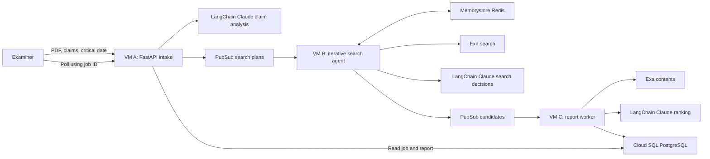
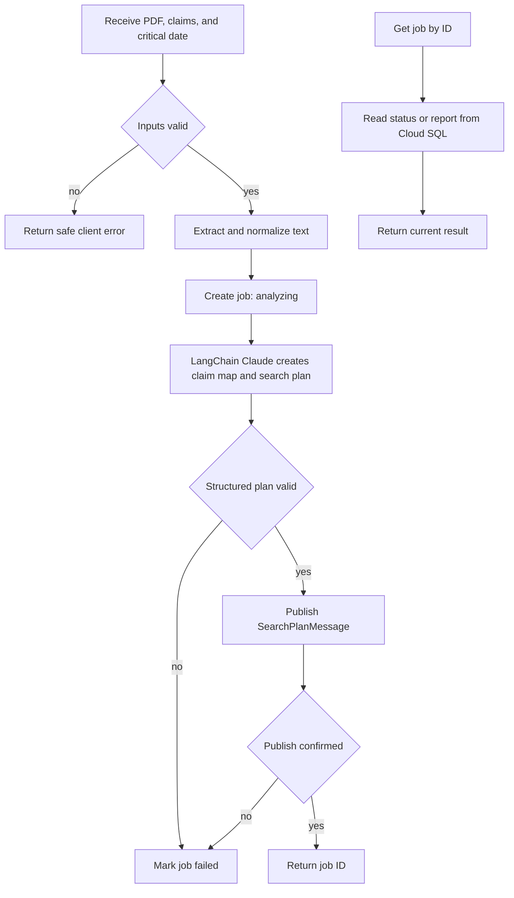
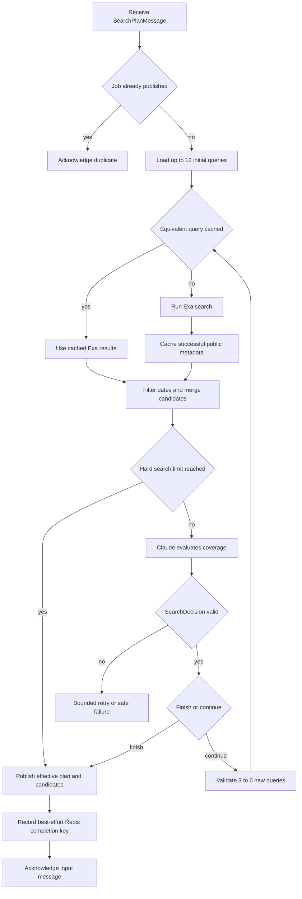
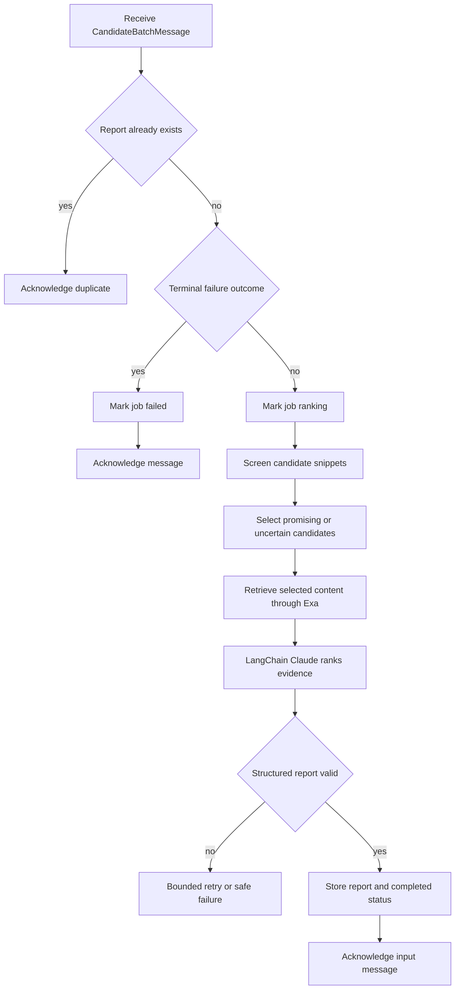

# Agentic Prior Art Search Assistant — High-Level Plan

Status: shared foundation implemented, including Section 6 updates; Components A–C pending
Language: Python  
Cloud: Google Cloud Platform (GCP)

## 1. Project Goal

Build a distributed application that helps a patent examiner find candidate
prior art. The user submits a patent specification, claims, and a critical
date. The system creates a search plan, searches non-patent literature, ranks
the results, and returns a citation-backed report for human review.

The application is a decision-support tool. It must not make legal conclusions
about patentability, anticipation, obviousness, or validity.

This document intentionally stays at the architectural level. Before
implementing a component, use `.cursor/rules/task-breakdown.mdc` to divide that
component into small implementation tasks.

## 2. Assignment Requirements

The deployed project will have three distinct Python processes:

1. Component A: application intake and claim analysis.
2. Component B: search orchestration and retrieval.
3. Component C: evidence ranking and report storage.

Each process will run on a separate GCP Compute Engine VM.

The project will use three of the assignment's required technology categories:

- Messaging: GCP Pub/Sub.
- Caching: GCP Memorystore for Redis.
- Database: GCP Cloud SQL for PostgreSQL.

The deployment will not use functions, containers, Kubernetes, or a service
mesh. Pub/Sub is treated only as messaging, so the project does not depend on
counting it as both messaging and queuing.

Claude and Exa are application APIs from the original proposal. Their use
should be confirmed with the instructor before cloud deployment because the
assignment restricts the permitted cloud components.

## 3. Inputs and Output

Component A will accept:

- a specification PDF containing embedded text;
- a UTF-8 plain-text `.txt` claims file; and
- a critical date in `YYYY-MM-DD` format.

Scanned or image-only PDFs are outside the initial scope. The project will not
include OCR.

The final output will be a structured report containing:

- ranked candidate references;
- source titles, URLs, and publication dates;
- the searches that found each candidate;
- claim limitations associated with each candidate;
- supporting passages when available;
- relevance explanations and uncertainty notes; and
- a clear statement that a human must make any legal determination.

## 4. Architecture

The three application components communicate asynchronously. Component A
returns a job ID after publishing the search plan. The user then polls
Component A until Component C has stored the final report.

Sections 5 through 11 are ordered by implementation: each foundation-update
section must be completed immediately before the component that depends on it.

## 5. Shared Foundation (IMPLEMENTED)

The three components share the `shared/` Python package for:

- validated message and report models;
- configuration loading;
- consistent safe logging;
- Pub/Sub serialization and validation;
- database access used by Components A and C; and
- narrow Claude and Exa interfaces that can be replaced with fakes in tests.

This shared foundation was built first. It prevents the independently
running components from disagreeing about message formats, job states, or
report structure and avoids duplicated code.

### 5.1 Implemented Foundation

The following foundation work is complete:

- `shared/bounds.py` defines job states and limits for claims, queries,
  candidates, content retrieval, uploads, retries, concurrency, and messages.
- `shared/models.py` defines validated search-plan, candidate-batch, and report
  contracts. It rejects extra fields, duplicate IDs, broken limitation links,
  duplicate candidate URLs, invalid date states, duplicate report ranks, and
  replacement of the required human-review disclaimer.
- `shared/config.py` loads required settings from environment variables or an
  optional `.env` file, fails on missing values, and masks API keys and the
  database DSN in its representation.
- `shared/logging.py` emits bounded lifecycle fields and redacts multiline,
  oversized, credential-like, and configured secret values.
- `shared/messaging.py` serializes pydantic models as bounded UTF-8 JSON and
  provides Publisher and Subscriber interfaces plus an in-memory FIFO broker.
- `shared/db.py` defines the PostgreSQL jobs/reports schema, the JobStore
  interface, and an idempotent in-memory implementation for local use.
- `shared/providers/claude.py` and `shared/providers/exa.py` define narrow
  provider interfaces and deterministic fakes that do not call paid APIs.
- The project uses Python 3.12+, a local `.venv`, and dependencies listed in
  `requirements.txt`.

The current message contracts intentionally have no schema-version field. If a
contract changes, all three components will be updated together.

## 6. Foundation Updates Required Before Component A (COMPLETED)

These shared updates are in place so Component A's output contract and tests
can depend on them:

- `shared/bounds.py` defines Component A's limit of at most 12 initial
  queries (`MAX_INITIAL_QUERIES`) separately from Component B's larger total
  search budget, and `SearchPlanMessage` enforces that 12-query limit.
- Automated tests cover the implemented foundation: models, configuration,
  logging, messaging, storage, and provider fakes. Later components then
  build on verified contracts.

## 7. Component A — Intake and Claim Analysis

Component A will be a FastAPI service responsible for:

- receiving the specification PDF, claims file, and critical date;
- validating file type, size, encoding, extracted text, and date;
- extracting embedded text from the specification;
- creating a job record in Cloud SQL;
- using a structured LangChain Claude call to identify claim limitations,
  concepts, synonyms, and at most 12 useful initial queries;
- validating Claude's structured response;
- publishing the search plan to Pub/Sub; and
- returning job status or the final stored report through the API.

Uploaded documents will be processed without long-term storage in the initial
version. Raw document text must not be placed in logs or Pub/Sub messages.

Building Component A also includes the production LangChain
(`langchain-anthropic`) claim-analysis adapter behind the existing `ClaudeClient`
interface; automated tests keep using the deterministic fake.

### Component A Sequence

## 8. Foundation Updates Required Before Component B (NOT COMPLETED)

The existing foundation must be extended before implementing the new Component
B design:

- `shared/bounds.py` must allow at most 40 total queries, eight search passes,
  seven Claude continuation decisions, and three to six follow-up queries per
  decision. It must also define a finite Redis cache TTL.
- `shared/models.py` must make `CandidateBatchMessage` carry the effective
  search plan, meaning the original plan plus every follow-up query actually
  executed by Component B. The job ID travels inside that plan, so Component C
  reads it from there.
- `CandidateBatchMessage` must also carry a sanitized terminal-failure outcome
  so Component C can mark a job failed when Component B's search permanently
  fails.
- Candidate query IDs must exist in that effective plan. A query's intended
  limitations must be derived from its `SearchQuery.limitation_ids` mapping
  rather than treated as independent proof that a document contains those
  limitations. Component C will make the actual evidence determination.
- `shared/providers/claude.py` must add a Component B search-decision operation
  and deterministic fake. Its production implementation will use
  `langchain-anthropic` with validated structured output.
- A real Exa API client is needed for production; Component B is its primary
  consumer. Tests keep using the deterministic fake.
- Component B must load only the Pub/Sub, Redis, Exa, Anthropic, and logging
  settings it needs; it must not receive Cloud SQL credentials.

The `SearchDecision` structure and iterative loop belong inside Component B,
not the shared foundation, because no other component needs them.

## 9. Component B — Search Orchestration and Retrieval

Component B will be a bounded iterative search agent running as one background
worker. It will:

- receive a structured search plan from Pub/Sub, not the raw specification or
  claims files;
- execute up to 12 initial Exa queries using bounded concurrency;
- check Redis before each equivalent Exa query and cache successful public
  result metadata for a limited time;
- re-validate publication dates after retrieval;
- enforce the critical date, normalize URLs, merge duplicates, and preserve
  which executed queries found each candidate;
- give Claude the claim limitations, tried queries, and bounded candidate
  snippets after each search pass;
- use a small validated `SearchDecision` response in which Claude chooses
  `finish` or `continue`, identifies remaining coverage gaps, and supplies
  three to six follow-up queries when continuing;
- repeat until Claude finishes or Python enforces a hard ceiling of 40 total
  queries, eight search passes, or seven continuation decisions;
- carry the original and follow-up queries forward as the effective search
  plan; and
- publish the candidates, effective plan, provenance, and cache totals to
  Component C through Pub/Sub.

Claude chooses when sufficient searching has been performed, but ordinary
Python controls the loop and all hard limits. The MVP will not use an
open-ended ReAct agent, LangGraph, multiple agents, or a feedback topic from
Component C.

Redis is part of the successful application path, not an unused supporting
service. Repeating the same searches should visibly produce cache hits.

Component B will not retrieve full documents, rank evidence, draw legal
conclusions, or access Cloud SQL. Those responsibilities remain with Component
C.

### Component B Sequence

Exa results feed the Claude decision, and Claude's follow-up queries feed the
next Exa pass through Component B. They are sequential parts of one bounded
loop, not parallel workflows.

## 10. Component C — Evidence Ranking and Report Storage

Component C will be a background worker responsible for:

- receiving candidate batches from Pub/Sub;
- screening snippets before requesting additional content;
- retrieving full Exa content only for a limited promising or uncertain set;
- using a structured LangChain Claude call to evaluate candidates against
  specific claim limitations;
- requiring source-linked supporting passages for positive findings;
- preserving uncertainty when dates or evidence are incomplete;
- generating the structured decision-support report; and
- storing the report and final job status in Cloud SQL.

Component C must handle duplicate Pub/Sub deliveries without creating duplicate
reports or repeating expensive ranking work unnecessarily.

Building Component C also includes the production LangChain Claude ranking
adapter behind the existing `ClaudeClient` interface; automated tests keep
using the deterministic fake.

### Component C Sequence

## 11. Production Adapters and Cloud Deployment (NOT COMPLETED)

These remaining foundation integrations are needed only when moving from the
in-memory fakes to GCP, after Components A–C work locally:

- a GCP Pub/Sub adapter with explicit acknowledgement and negative
  acknowledgement handling;
- a Cloud SQL implementation of JobStore that executes the included schema;
- production wiring that selects real adapters while tests inject fakes; and
- GCP resources and deployment of each process to its own Compute Engine VM.

## 12. High-Level Data Contracts

Component A publishes a search-plan message containing:

- job ID;
- critical date;
- structured claim limitations;
- concepts and synonyms; and
- up to 12 initial search queries linked to their intended limitations.

Component B publishes a candidate message containing:

- the effective search plan containing both initial and executed follow-up
  queries;
- candidate titles, URLs, dates, and short snippets;
- date-verification state;
- the query IDs that actually found each candidate; and
- aggregate search and cache information.

The effective plan is the source of query-to-limitation search intent.
Component C must independently determine whether a candidate actually
discloses a limitation.

Component C stores a report containing:

- job ID and critical date;
- ranked candidate evidence;
- matched claims and limitations;
- citations and supporting passages;
- query provenance;
- uncertainty notes; and
- the decision-support disclaimer.

Messages should remain small and contain structured intermediate results rather
than uploaded files or full source documents.

## 13. End-to-End Flow

1. The user submits the three inputs to Component A.
2. Component A validates the inputs and creates a job.
3. Claude produces a validated claim map and search plan.
4. Component A publishes the plan and returns a job ID.
5. Component B receives the plan, checks Redis, and runs the initial Exa
   searches.
6. Component B consolidates the results and asks Claude whether to finish or
   generate targeted follow-up queries. It repeats within the configured hard
   limits, then publishes the effective plan and candidate batch.
7. Component C receives the candidates, retrieves selected evidence, and asks
   Claude to rank it.
8. Component C stores the completed report in Cloud SQL.
9. The user retrieves the report from Component A using the job ID.

## 14. Reliability

- Pub/Sub delivers messages at least once, so processing must be idempotent.
- A component must not acknowledge its input until its required output has been
  published or stored successfully.
- Temporary provider or network failures should receive bounded retries.
- Invalid inputs and non-retryable failures should produce a safe failed job
  state instead of an indefinitely running job.
- External calls, message sizes, query counts, result counts, concurrency, and
  uploaded files must all be bounded.
- Component B permits at most 12 initial queries, 40 total queries, eight search
  passes, seven Claude continuation decisions, and three to six follow-up
  queries per continuation.
- Claude may finish the search early, but it cannot override those limits or
  execute Exa, Redis, or Pub/Sub operations directly.
- Job states should be simple and visible: analyzing, searching, ranking,
  completed, or failed.
- Logs should include the component, job ID, lifecycle event, duration, and
  safe error code so the complete workflow can be demonstrated.

## 15. Security

- Treat uploaded patent text and retrieved web content as untrusted data, not
  as model instructions.
- Treat Exa snippets supplied to the search agent as untrusted data.
- Validate all files, API data, Pub/Sub messages, and model output.
- Do not execute uploaded content or fetch arbitrary result URLs directly.
- Keep Claude, Exa, database, and Redis credentials outside Git.
- Use separate least-privilege service accounts and database users.
- Place Cloud SQL and Memorystore on private networking.
- Run each service as a dedicated non-root user.
- Do not expose an unauthenticated upload endpoint publicly. Use an encrypted
  IAP or SSH tunnel for the class demonstration.
- Do not log uploaded text, prompts, credentials, or full provider responses.
- Use public or synthetic patent data for tests and screenshots.

## 16. Build Order

Build the project in the order of Sections 5–11:

1. Foundation updates required before Component A (Section 6).
2. Component A and its API (Section 7).
3. Foundation updates required before Component B (Section 8).
4. Component B and its LangChain-guided, Redis-backed iterative Exa search
   (Section 9).
5. Component C and Cloud SQL report persistence (Section 10).
6. Production adapters, GCP resources, and deployment of each process to its
   own VM (Section 11).
7. End-to-end testing, documentation, cleanup instructions, and screenshots.

After selecting one item from this list, apply the task-breakdown rule to that
item before writing code. Implement and validate those smaller tasks one at a
time before moving to the next component.

## 17. Testing and Demonstration

Fake Claude, Exa, Pub/Sub, and database implementations are available.
Automated tests for the shared foundation use those fakes by default so they
do not require paid APIs or cloud services. A Redis fake still needs to be
added with Component B.

Component B tests must demonstrate immediate agent-selected stopping,
continuation with new queries, forced stopping at the configured budgets,
rejection of invalid follow-up queries, query provenance, date filtering,
deduplication, and Redis miss-to-hit behavior.

The final cloud demonstration should show:

- all three Python processes running on separate VMs;
- both Pub/Sub handoffs;
- a successful API submission and returned job ID;
- Redis cache misses on the first search and hits on a repeated search;
- a completed report stored in Cloud SQL;
- retrieval of that report through Component A; and
- safe handling of at least one invalid submission.

## 18. Documentation Deliverables

The repository documentation should include:

- the business problem and project scope;
- the architecture and data flow;
- how messaging, caching, and the database are used;
- setup, configuration, deployment, and teardown instructions;
- testing and demonstration steps;
- retry, idempotency, and security decisions;
- known limitations and cost considerations; and
- screenshots proving the end-to-end system works.

## 19. Completion Criteria

The project is complete when:

- Components A, B, and C run on three GCP VMs;
- Pub/Sub, Memorystore, and Cloud SQL all participate in the successful path;
- a valid submission produces a stored, retrievable report;
- Component B can refine weak searches and finish early when Claude determines
  that further searching is unlikely to improve coverage;
- duplicate messages do not create duplicate reports;
- invalid inputs and provider failures are handled safely;
- no secrets or confidential document content are committed or logged; and
- documentation and screenshots provide clear evidence for every rubric area.
