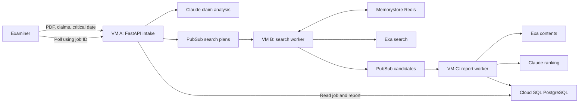

# Agentic Prior Art Search Assistant — High-Level Plan

Status: planning reference  
Language: Python  
Cloud: Google Cloud Platform (GCP)

## 1. Project Goal

Build a distributed application that helps a patent examiner find candidate
prior art. The user submits a patent specification, claims, and a critical
date. The system creates a search plan, searches non-patent literature, ranks
the results, and returns a citation-backed report for human review.

The application is a decision-support tool. It must not make legal conclusions
about patentability, anticipation, obviousness, or validity.

This document intentionally stays at the architectural level. Before
implementing a component, use `.cursor/rules/task-breakdown.mdc` to divide that
component into small implementation tasks.

## 2. Assignment Requirements

The deployed project will have three distinct Python processes:

1. Component A: application intake and claim analysis.
2. Component B: search orchestration and retrieval.
3. Component C: evidence ranking and report storage.

Each process will run on a separate GCP Compute Engine VM.

The project will use three of the assignment's required technology categories:

- Messaging: GCP Pub/Sub.
- Caching: GCP Memorystore for Redis.
- Database: GCP Cloud SQL for PostgreSQL.

The deployment will not use functions, containers, Kubernetes, or a service
mesh. Pub/Sub is treated only as messaging, so the project does not depend on
counting it as both messaging and queuing.

Claude and Exa are application APIs from the original proposal. Their use
should be confirmed with the instructor before cloud deployment because the
assignment restricts the permitted cloud components.

## 3. Inputs and Output

Component A will accept:

- a specification PDF containing embedded text;
- a UTF-8 plain-text `.txt` claims file; and
- a critical date in `YYYY-MM-DD` format.

Scanned or image-only PDFs are outside the initial scope. The project will not
include OCR.

The final output will be a structured report containing:

- ranked candidate references;
- source titles, URLs, and publication dates;
- the searches that found each candidate;
- claim limitations associated with each candidate;
- supporting passages when available;
- relevance explanations and uncertainty notes; and
- a clear statement that a human must make any legal determination.

## 4. Architecture

The three application components communicate asynchronously. Component A
returns a job ID after publishing the search plan. The user then polls
Component A until Component C has stored the final report.

## 5. Shared Foundation

The three components should share a small Python package for:

- validated message and report models;
- configuration loading;
- consistent safe logging;
- Pub/Sub serialization and validation;
- database access used by Components A and C; and
- narrow Claude and Exa interfaces that can be replaced with fakes in tests.

This shared foundation should be built first. It prevents the independently
running components from disagreeing about message formats, job states, or
report structure and avoids duplicated code.

## 6. Component A — Intake and Claim Analysis

Component A will be a FastAPI service responsible for:

- receiving the specification PDF, claims file, and critical date;
- validating file type, size, encoding, extracted text, and date;
- extracting embedded text from the specification;
- creating a job record in Cloud SQL;
- asking Claude to identify claim limitations, concepts, synonyms, and useful
  query combinations;
- validating Claude's structured response;
- publishing the search plan to Pub/Sub; and
- returning job status or the final stored report through the API.

Uploaded documents will be processed without long-term storage in the initial
version. Raw document text must not be placed in logs or Pub/Sub messages.

## 7. Component B — Search Orchestration and Retrieval

Component B will be a background worker responsible for:

- receiving search plans from Pub/Sub;
- executing a bounded number of Exa searches concurrently;
- using the critical date as an initial publication-date filter;
- checking Redis before repeating an equivalent Exa query;
- caching successful public Exa result metadata for a limited time;
- validating publication dates again after retrieval;
- normalizing URLs and merging duplicate results;
- preserving which queries and limitations found each candidate; and
- publishing the candidate batch to Component C through Pub/Sub.

Redis is part of the successful application path, not an unused supporting
service. Repeating the same searches should visibly produce cache hits.

## 8. Component C — Evidence Ranking and Report Storage

Component C will be a background worker responsible for:

- receiving candidate batches from Pub/Sub;
- screening snippets before requesting additional content;
- retrieving full Exa content only for a limited promising or uncertain set;
- asking Claude to evaluate candidates against specific claim limitations;
- requiring source-linked supporting passages for positive findings;
- preserving uncertainty when dates or evidence are incomplete;
- generating the structured decision-support report; and
- storing the report and final job status in Cloud SQL.

Component C must handle duplicate Pub/Sub deliveries without creating duplicate
reports or repeating expensive ranking work unnecessarily.

## 9. High-Level Data Contracts

Component A publishes a search-plan message containing:

- message version and job ID;
- critical date;
- structured claim limitations;
- concepts and synonyms; and
- bounded search queries linked to relevant limitations.

Component B publishes a candidate message containing:

- message version and job ID;
- candidate titles, URLs, dates, and short snippets;
- date-verification state;
- finding query IDs and related limitation IDs; and
- aggregate search and cache information.

Component C stores a report containing:

- job ID and critical date;
- ranked candidate evidence;
- matched claims and limitations;
- citations and supporting passages;
- query provenance;
- uncertainty notes; and
- the decision-support disclaimer.

Messages should remain small and contain structured intermediate results rather
than uploaded files or full source documents.

## 10. End-to-End Flow

1. The user submits the three inputs to Component A.
2. Component A validates the inputs and creates a job.
3. Claude produces a validated claim map and search plan.
4. Component A publishes the plan and returns a job ID.
5. Component B receives the plan and checks Redis for reusable searches.
6. Component B calls Exa for cache misses, filters and deduplicates the results,
   and publishes the candidate batch.
7. Component C receives the candidates, retrieves selected evidence, and asks
   Claude to rank it.
8. Component C stores the completed report in Cloud SQL.
9. The user retrieves the report from Component A using the job ID.

## 11. Reliability

- Pub/Sub delivers messages at least once, so processing must be idempotent.
- A component must not acknowledge its input until its required output has been
  published or stored successfully.
- Temporary provider or network failures should receive bounded retries.
- Invalid inputs and non-retryable failures should produce a safe failed job
  state instead of an indefinitely running job.
- External calls, message sizes, query counts, result counts, concurrency, and
  uploaded files must all be bounded.
- Job states should be simple and visible: analyzing, searching, ranking,
  completed, or failed.
- Logs should include the component, job ID, lifecycle event, duration, and
  safe error code so the complete workflow can be demonstrated.

## 12. Security

- Treat uploaded patent text and retrieved web content as untrusted data, not
  as model instructions.
- Validate all files, API data, Pub/Sub messages, and model output.
- Do not execute uploaded content or fetch arbitrary result URLs directly.
- Keep Claude, Exa, database, and Redis credentials outside Git.
- Use separate least-privilege service accounts and database users.
- Place Cloud SQL and Memorystore on private networking.
- Run each service as a dedicated non-root user.
- Do not expose an unauthenticated upload endpoint publicly. Use an encrypted
  IAP or SSH tunnel for the class demonstration.
- Do not log uploaded text, prompts, credentials, or full provider responses.
- Use public or synthetic patent data for tests and screenshots.

## 13. Build Order

Build the project in this order:

1. Shared foundation and data contracts.
2. Component A and its API.
3. Component B and Redis-backed Exa searching.
4. Component C and Cloud SQL report persistence.
5. GCP resources and deployment of each process to its own VM.
6. End-to-end testing, documentation, cleanup instructions, and screenshots.

After selecting one item from this list, apply the task-breakdown rule to that
item before writing code. Implement and validate those smaller tasks one at a
time before moving to the next component.

## 14. Testing and Demonstration

Automated tests should use fake Claude, Exa, Pub/Sub, Redis, and database
adapters by default so tests do not require paid APIs.

The final cloud demonstration should show:

- all three Python processes running on separate VMs;
- both Pub/Sub handoffs;
- a successful API submission and returned job ID;
- Redis cache misses on the first search and hits on a repeated search;
- a completed report stored in Cloud SQL;
- retrieval of that report through Component A; and
- safe handling of at least one invalid submission.

## 15. Documentation Deliverables

The repository documentation should include:

- the business problem and project scope;
- the architecture and data flow;
- how messaging, caching, and the database are used;
- setup, configuration, deployment, and teardown instructions;
- testing and demonstration steps;
- retry, idempotency, and security decisions;
- known limitations and cost considerations; and
- screenshots proving the end-to-end system works.

## 16. Completion Criteria

The project is complete when:

- Components A, B, and C run on three GCP VMs;
- Pub/Sub, Memorystore, and Cloud SQL all participate in the successful path;
- a valid submission produces a stored, retrievable report;
- duplicate messages do not create duplicate reports;
- invalid inputs and provider failures are handled safely;
- no secrets or confidential document content are committed or logged; and
- documentation and screenshots provide clear evidence for every rubric area.
